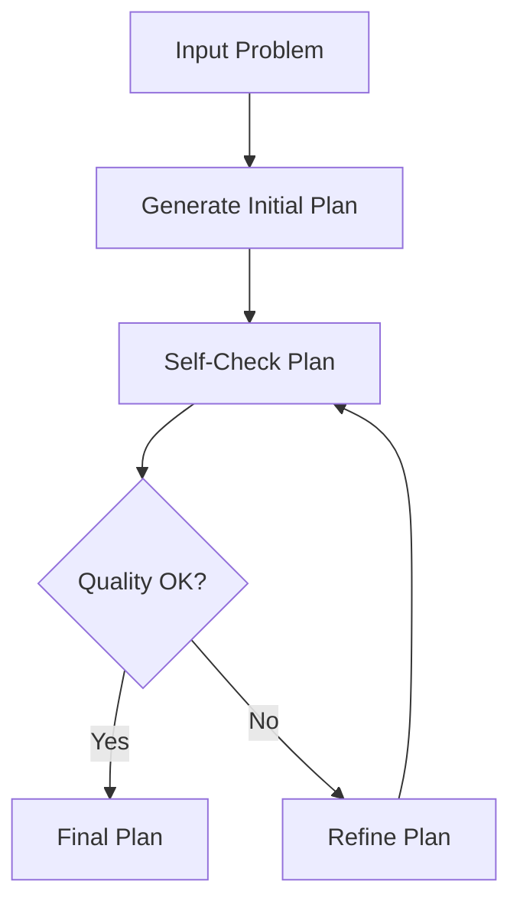

# Self-Refinement for LLM Planners Framework

## Framework Overview



## Overview
This project implements the "Self-Refinement for LLM Planners" framework as part of a master's thesis in Computer Science – AI & Big Data. The framework evaluates and compares various Large Language Model (LLM) providers using automated self-checking feedback loops and iterative refinement strategies. The goal is to analyze quality improvement, convergence speed, efficiency, and reliability across different LLMs and planning scenarios.

## Features
- Multi-provider comparison: GPT-4, Claude, Gemini, and a Mock model
- Support for multiple planning scenarios: Travel, Cooking, Project Management, Events
- Real-time performance metrics: Quality, Speed, Consistency, Cost, Creativity
- Iterative refinement engine with convergence checking
- Visual dashboards and heatmaps for comparative analysis
- Scenario-specific evaluation and benchmarking


## Installation
```bash
# Clone the repository
git clone https://github.com/moelhaj996/-Self-Refinement-for-LLM-Planners-Framework.git
cd Self-Refinement-for-LLM-Planners-Framework

# Create and activate a virtual environment
python3 -m venv venv
source venv/bin/activate

# Install dependencies
pip install -r requirements.txt
```

## Usage
1. Run the notebooks under `/notebooks/` to:
   - Simulate LLM planning outputs
   - Apply self-checking logic
   - Measure performance improvement
2. Visual outputs are saved in `/dashboards/`.

## Visual Highlights
- Radar charts for multi-dimensional comparison
- Bar charts for quality improvement, response time, and cost
- Scenario vs. provider heatmap
- Quality progression over iterations

## Example Metrics
- 95% convergence rate
- 28% average quality improvement
- 2.3s avg response time (GPT-4)
- Claude performed best in convergence speed