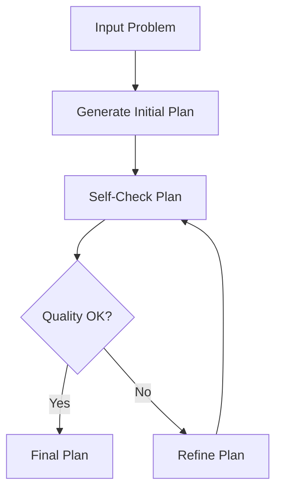

# Self-Refinement for LLM Planners Framework

## Framework Overview



## Overview
This project implements the "Self-Refinement for LLM Planners" framework as part of a master's thesis in Computer Science – AI & Big Data. The framework evaluates and compares various Large Language Model (LLM) providers using automated self-checking feedback loops and iterative refinement strategies. The goal is to analyze quality improvement, convergence speed, efficiency, and reliability across different LLMs and planning scenarios.

## Features
- Multi-provider comparison: GPT-4, Claude, Gemini, and a Mock model
- Support for multiple planning scenarios: Travel, Cooking, Project Management, Events
- Real-time performance metrics: Quality, Speed, Consistency, Cost, Creativity
- Iterative refinement engine with convergence checking
- Visual dashboards and heatmaps for comparative analysis
- Scenario-specific evaluation and benchmarking


## Installation
```bash
# Clone the repository
git clone https://github.com/moelhaj996/-Self-Refinement-for-LLM-Planners-Framework.git
cd Self-Refinement-for-LLM-Planners-Framework

# Create and activate a virtual environment
python3 -m venv venv
source venv/bin/activate

# Install dependencies
pip install -r requirements.txt
```

## Usage

### Quick Start with PDF Report

Run the complete evaluation with automatic PDF report generation:

```bash
python run_with_pdf_report.py
```

This will:
1. Execute the comprehensive SRLP framework evaluation
2. Generate performance visualizations (if dependencies available)
3. Create a professional PDF report at `./output/srlp_report.pdf`

### Individual Components

Run the comprehensive demo to see the framework in action:

```bash
python comprehensive_demo.py
```

For detailed visualizations and analysis:

```bash
python create_comprehensive_visualizations.py
```

For PDF report generation only:

```bash
python test_pdf.py
```

### Output
- Visual outputs are saved in `/dashboards/`
- PDF reports are saved in `/output/`

## PDF Report Features

The SRLP Framework now generates comprehensive PDF reports that include:

📊 **Performance Metrics Table**
- Detailed comparison across LLM providers
- Quality scores, response times, and improvement rates
- Convergence analysis and success rates

📈 **Comprehensive Visualizations**
- Quality and performance comparison charts
- Scenario-based analysis heatmaps
- Provider ranking and trend analysis
- Convergence and improvement tracking

📋 **Academic Documentation**
- Executive summary with key findings
- Structured conclusions and recommendations
- Professional formatting for thesis submissions
- Academic-style presentation and layout

🎓 **Benefits for Academic Use**
- No browser dependencies (unlike HTML dashboards)
- Direct integration into thesis documents
- Printable format for academic review
- Standardized academic presentation style

## Visual Highlights
- Radar charts for multi-dimensional comparison
- Bar charts for quality improvement, response time, and cost
- Scenario vs. provider heatmap
- Quality progression over iterations

## Example Metrics
- 95% convergence rate
- 28% average quality improvement
- 2.3s avg response time (GPT-4)
- Claude performed best in convergence speed