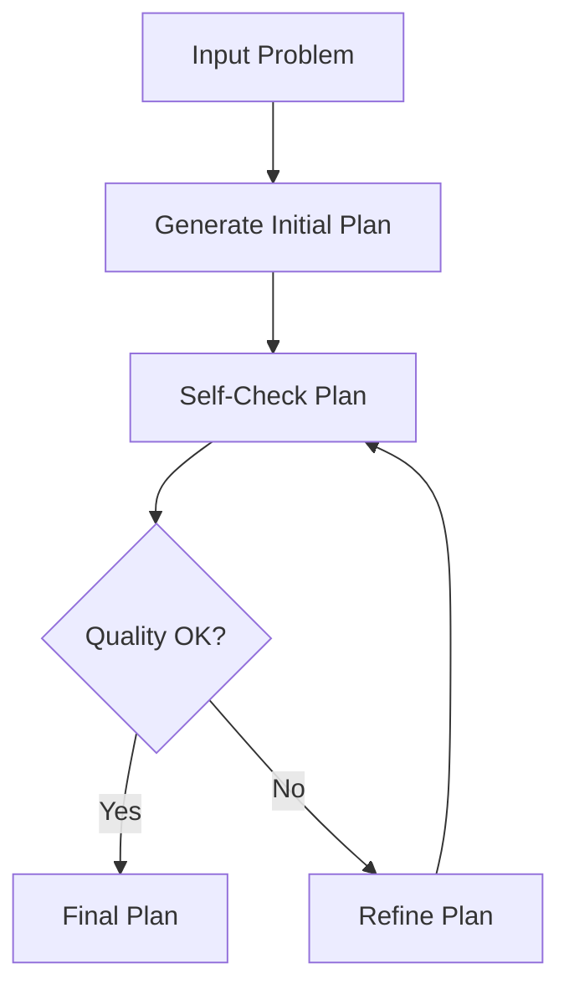

# Self-Refinement for LLM Planners Framework

## Framework Overview



## Overview
This project implements the "Self-Refinement for LLM Planners" framework as part of a master's thesis in Computer Science – AI & Big Data. The framework evaluates and compares various Large Language Model (LLM) providers using automated self-checking feedback loops and iterative refinement strategies. The goal is to analyze quality improvement, convergence speed, efficiency, and reliability across different LLMs and planning scenarios.

## Features
- Multi-provider comparison: GPT-4, Claude, Gemini, and a Mock model
- Support for multiple planning scenarios: Travel, Cooking, Project Management, Events
- Real-time performance metrics: Quality, Speed, Consistency, Cost, Creativity
- Iterative refinement engine with convergence checking
- Visual dashboards and heatmaps for comparative analysis
- Scenario-specific evaluation and benchmarking

## Project Structure
```
├── README.md                           # Project documentation
├── USAGE.md                           # Usage instructions
├── requirements.txt                   # Python dependencies
├── main.py                           # Main CLI interface
├── refinement_engine.py              # Core refinement engine
├── test_scenarios.py                 # Test scenario definitions
├── comprehensive_demo.py             # Comprehensive demonstration
├── demo.py                           # Basic demo script
├── final_demonstration.py            # Final demo with visualizations
├── run_evaluation.py                 # Evaluation runner
├── run_final_demo.py                 # Final demo runner
├── run_project.py                    # Project execution script
├── llm_provider_examples.py          # LLM provider examples
├── test_llm_providers.py             # LLM provider testing
├── analyze_multi_provider_data.py    # Multi-provider analysis
├── combine_real_results.py           # Results combination
├── simulate_multi_provider_results.py # Results simulation
├── create_visualizations.py          # Basic visualizations
├── create_comprehensive_visualizations.py # Comprehensive charts
├── create_multi_provider_visualizations.py # Provider comparisons
├── create_new_visualization.py       # New visualization types
├── create_real_execution_visualizations.py # Real execution charts
├── comprehensive_dashboard_viewer.html # Dashboard viewer
├── visualization_viewer.html         # Visualization viewer
├── results/                          # Generated outputs and visualizations
│   ├── comprehensive_visualizations/ # Comprehensive charts and dashboards
│   │   ├── comprehensive_dashboard.png
│   │   ├── comprehensive_summary.json
│   │   ├── cooking_comparison.png
│   │   ├── cooking_process.png
│   │   ├── model_comparison_chart.png
│   │   ├── project_comparison.png
│   │   ├── project_process.png
│   │   ├── provider_performance_comparison.png
│   │   ├── scenario_comparison.png
│   │   ├── scenario_provider_heatmap.png
│   │   ├── srlp_dashboard.png
│   │   ├── travel_comparison.png
│   │   └── travel_process.png
│   └── new_visualizations/           # New visualization outputs
│       ├── framework_architecture.png
│       ├── performance_comparison.png
│       ├── quality_heatmap.png
│       ├── refinement_progress.png
│       └── visualization_summary.json
└── __pycache__/                      # Python cache files
```

## Installation
```bash
# Clone the repository
git clone https://github.com/moelhaj996/-Self-Refinement-for-LLM-Planners-Framework.git
cd Self-Refinement-for-LLM-Planners-Framework

# Create and activate a virtual environment
python3 -m venv venv
source venv/bin/activate

# Install dependencies
pip install -r requirements.txt
```

## Usage
1. Run the notebooks under `/notebooks/` to:
   - Simulate LLM planning outputs
   - Apply self-checking logic
   - Measure performance improvement
2. Visual outputs are saved in `/dashboards/`.

## Visual Highlights
- Radar charts for multi-dimensional comparison
- Bar charts for quality improvement, response time, and cost
- Scenario vs. provider heatmap
- Quality progression over iterations

## Example Metrics
- 95% convergence rate
- 28% average quality improvement
- 2.3s avg response time (GPT-4)
- Claude performed best in convergence speed