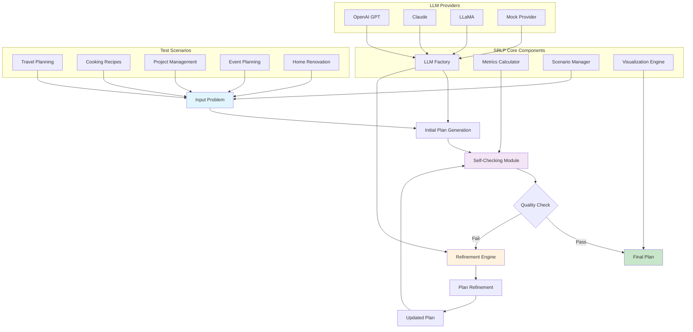

# Self-Refinement for LLM Planners Framework

## Framework Architecture

```mermaid
graph TD
    A[Input Problem] --> B[Initial Plan Generation]
    B --> C[Self-Checking Module]
    C --> D{Quality Check}
    D -->|Pass| E[Final Plan]
    D -->|Fail| F[Refinement Engine]
    F --> G[Plan Refinement]
    G --> H[Updated Plan]
    H --> C
    
    subgraph "SRLP Core Components"
        I[LLM Factory]
        J[Metrics Calculator]
        K[Scenario Manager]
        L[Visualization Engine]
    end
    
    subgraph "LLM Providers"
        M[OpenAI GPT]
        N[Claude]
        O[LLaMA]
        P[Mock Provider]
    end
    
    subgraph "Test Scenarios"
        Q[Travel Planning]
        R[Cooking Recipes]
        S[Project Management]
        T[Event Planning]
        U[Home Renovation]
    end
    
    I --> B
    I --> F
    J --> C
    K --> A
    L --> E
    
    M --> I
    N --> I
    O --> I
    P --> I
    
    Q --> A
    R --> A
    S --> A
    T --> A
    U --> A
    
    style A fill:#e1f5fe
    style E fill:#c8e6c9
    style F fill:#fff3e0
    style C fill:#f3e5f5
```